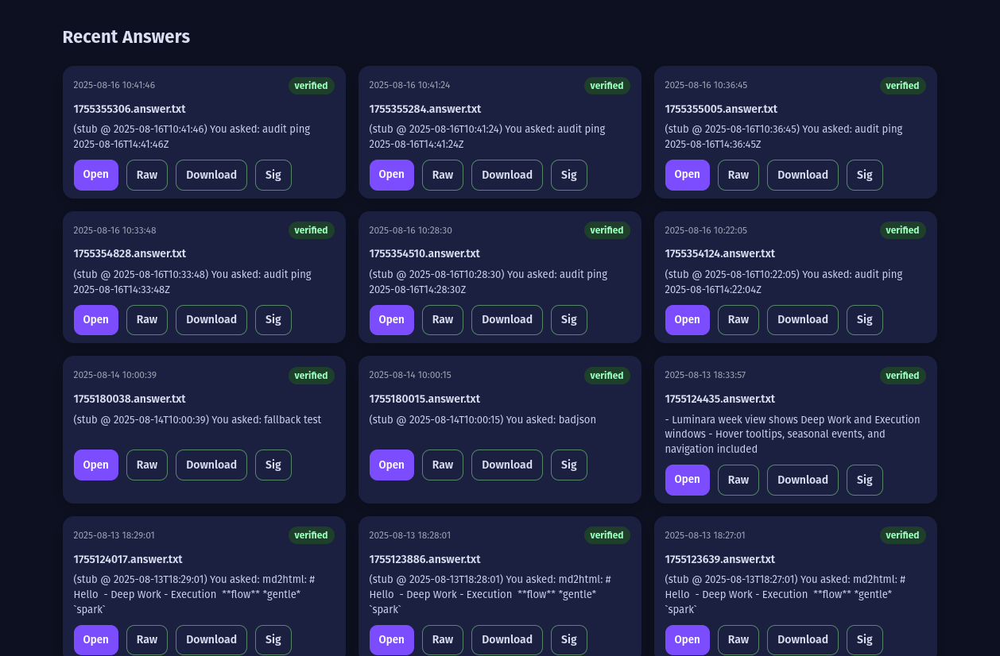
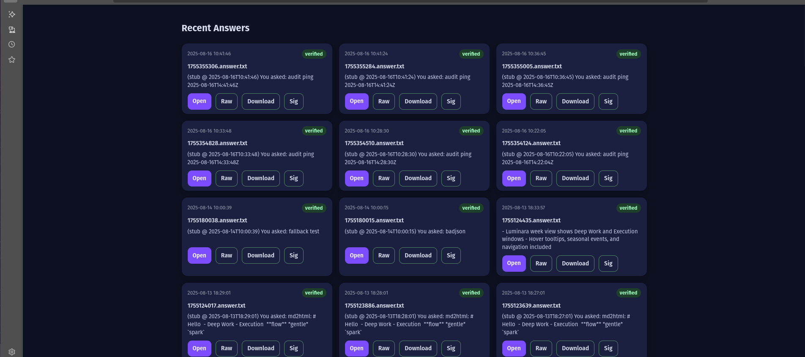

# Aletheia – Recent Feed UI

[](https://github.com/StormBelfiore/aletheia-recent-feed/actions/workflows/ci.yml)

A FastAPI dashboard for listing recent `*.answer.txt` files, verifying them with `ssh-keygen -Y verify`, and serving a live UI with secure downloads.

---

## Features
- ✅ Health-checked FastAPI service  
- 🔑 Cryptographic signature verification (SSH)  
- 📊 Live dashboard for recent answers  
- 📥 Secure file downloads  

---

## Quick start

```bash
git clone https://github.com/StormBelfiore/aletheia-recent-feed.git
cd aletheia-recent-feed
python3 -m venv .venv && source .venv/bin/activate
pip install -r requirements.txt

export AOS_OUTBOX="$HOME/AletheiaOS/core/black_room/outbox"
export AOS_ALLOWED_SIGNERS="$HOME/.config/aletheia/allowed_signers"
export AOS_SIGNER_ID="aletheia"

uvicorn app.main:app --reload --host 127.0.0.1 --port 8098

## Screenshots

## Screenshots

### Dashboard


### Health endpoint



**Health endpoint**

